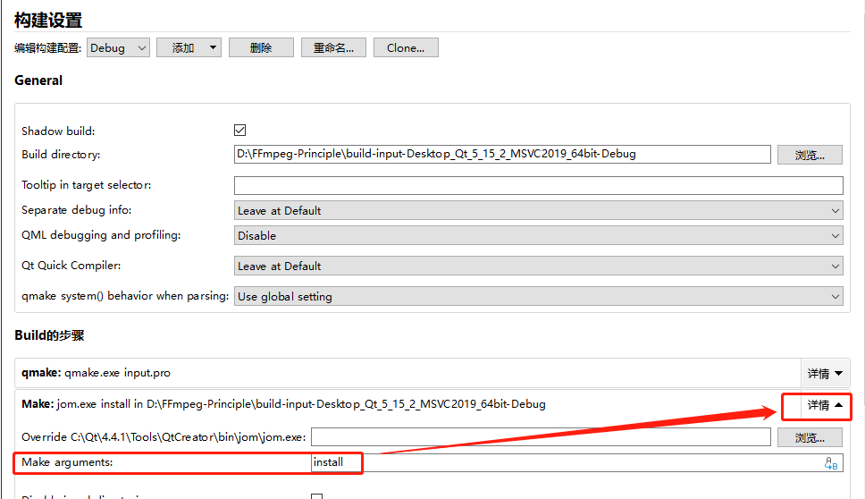

# 如何使用FFmpeg的编码器—FFmpeg API教程

本文介绍如何使用FFmpeg 函数来编码 yuv 数据 生成 AVPakcet

本文的代码下载地址：[GitHub](https://github.com/lokenetwork/FFmpeg-Principle/tree/main/encode)，编译环境是 Qt 5.15.2 跟 MSVC2019_64bit 。

注意事项，需要配置 install 参数，才能把 `juren-30s.mp4 ` 跟 相关的 FFmpeg DLL 文件会拷贝到调试目录，配置 install 的参数如下：

------

跟**编码**相关的结构体如下：

1，`AVCodecContext`，这个结构体可以是 **编码器** 的上下文，也可以是 **解码器** 的上下文，两者使用的是同一种数据结构。

2，`AVCodec`，编解码信息。

3，`AVCodecParameters`，编解码参数。

4，`AVPacket` ， YUV经过编码压缩之后的数据，在 [《AVPacket结构体使用介绍》](https://ffmpeg.xianwaizhiyin.net/api-ffmpeg/avpacket.html)有介绍。

5，`AVFrame` ，解码之后的 YUV 数据。`AVFrame` 跟 `AVPacket` 类似，都是一个管理数据的结构体，他们本身是没有数据的，只是引用了数据。

------

跟**编码**相关的API函数如下：

1，`avcodec_alloc_context3`，通过传递 `AVCodec` **编解码信息**来初始化上下文。

2，`avcodec_open2`，打开一个编码器 或者 解码器。

**2，`avcodec_is_open`，判断 一个编码器 或者 解码器 是否打开**

3，`avcodec_send_frame`，往 `AVCodecContext` 编码器 发送一个 `AVFrame`。

4，`avcodec_receive_packet`，从 `AVCodecContext` 编码器 读取一个 `AVPacket`。

------

请先下载本文代码仔细阅读一遍。

之前从 mp4  解码出来了 YUV 数据， 本文的代码逻辑是把这些 YUV 数据重新编码压缩成 H264，生成 `AVPacket`。代码如下：

上面是打开一个编码器的流程，打开编码器的代码量 明显比打开解码器要多，这是因为 打开解码器 可以调 `avcodec_parameters_to_context` 把流的宽高等信息直接复制到 `AVCodecContext`。

而编码器，需要从 `AVFrame` 里面提取宽高，像素格式这些东西。宽高，像素之类的信息，我看到好像在打开文件的时候也能获取到，不需要解码出 `AVFrame`。

但是有一种情况，就是 有可能会使用滤镜，例如裁剪滤镜，这样宽高等信息就变了，所以最好是用 `AVFrame` 的信息来设置编码器。

打开编码器跟打开解码器有以下不同的地方：

1. 解码器没有设置 time_base （时间基），编码器需要设置时间基。为什么要设置，我也不知道，反正设置了不会有问题。

------

上面的代码设置了一下 `sample_aspect_ratio` ，这个可以理解为像素的宽高比，现在通常是 1:1，但有些电视是矩形像素，不是正方形。

推荐阅读《[ffmpeg解析出的视频参数PAR，DAR，SAR的意义](https://blog.csdn.net/zhizhuodewo6/article/details/105247557)》 跟  《[theory-videoaspectratios](https://www.animemusicvideos.org/guides/avtech3/theory-videoaspectratios.html)》

------

继续分析本文的代码，下面是往 编码器 发数据跟收数据的代码，如下：

其实编码过程跟解码过程是类似，发了一个 `AVFrame` 后，需要循环不断读取 `AVPacket` 直到返回 EAGAIN 。

------

同样，当读到末尾的时候，也需要往编码器发送一个NULL，告诉编码器没有更多的 `AVFrame` 输入了，这样编码器内部就知道已经没有更多的输入了，只要把剩下的 `AVPacket` 全部刷出去，刷完就会返回 `AVERROR_EOF`。代码如下：

------

至此，FFmpeg 的编码器的使用就讲解完毕，下篇文章讲解如何把这些 `AVPacket` 写进去文件里面保存。
