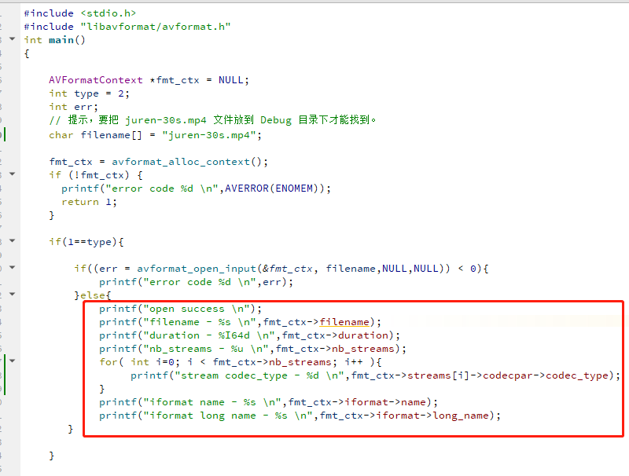

# FFmpeg打开输入文件—FFmpeg API教程

<div id="meta-description---">本文介绍如何使用 FFmpeg 的 API 函数 avformat_open_input，avformat_find_stream_info 来打开跟获取一个输入文件的信息 （AVFormatContext ）。</div>

本文介绍如何使用 FFmpeg 的 API 函数 `avformat_open_input`，`avformat_find_stream_info`  来打开跟获取一个输入文件的信息 （AVFormatContext ）。

------

本文的代码下载地址：[GitHub](https://github.com/lokenetwork/FFmpeg-Principle/tree/main/input)，编译环境是 Qt 5.15.2 跟 MSVC2019_64bit 。

注意事项，需要配置 install 参数，要不 `juren-30s.mp4 ` 跟 相关的 FFmpeg DLL 文件会没有拷贝到调试目录，配置 install 的参数如下：


------

与打开输入文件相关的 API 函数如下：

**1，**`avformat_open_input`，打开输入文件，这个函数会生成 `AVFormatContext` ，函数定义如下：

```
int avformat_open_input(AVFormatContext **ps, const char *filename,
                        ff_const59 AVInputFormat *fmt, AVDictionary **options)
```

其实有两种打开输入文件的方式，如下：

- `char *filename`， 根据文件名的后缀来猜测以什么样的封装格式打开文件，例如 mp4，m4a 后缀的文件 都用 mov 封装格式来打开。
- `AVInputFormat *fmt`，指定某一种格式，不用猜测。

FFmpeg 的函数 经常会有 `options` 这个参数，因为每种封装格式都支持很多定制参数的，例如 mp4 封装格式支持 `movflags:faststart`，这样可以 在录制完成之后把 `moov` 移动到文件头部，这样在网络里面播放 mp4 的时候，就会更快一些。

初学者可以暂时不用管 `options` 参数，直接传 `NULL` 即可，后续可以看 《[如何设置解复用器参数](https://ffmpeg.xianwaizhiyin.net/api-ffmpeg/demuxer_args.html)》。

------

**2，**`avformat_find_stream_info`，探测函数，读取输入文件的一部分信息来分析出 各个流的情况，通常用于一些没有头信息的封装格式，例如 MPEG。

```
int avformat_find_stream_info(AVFormatContext *ic, AVDictionary **options);
```

------

与打开输入文件相关的结构体如下：

**1，** `AVFormatContext` ，或者叫封装格式上下文。可以理解为 MP4 或者 FLV 的容器。

2，`AVStream` ，容器里面的流。

------

下面就结合本文代码来理解 上面这些函数跟结构体 的使用。请看下图：



我上面的代码，打开了一个 mp4 文件，然后输出了 一些文件信息，如下：


从上图可以看出，顺利获取到 mp4 的 duration 时长，时间基 是 `AV_TIME_BASE` 常量，所以这是一个30秒的视频。`nb_streams` 等于 2 代表这个文件有两个流，通过 `codec_type`  可以知道是 视频流 还是 音频流。

然后 `iformat` 里面的 `name` 代表文件后缀名。就是说 `"mov,mp4,m4a,3gp,3g2,mj2"` ，等等这些后缀名的文件都是用同一个解复用器来解析的，因为他们的格式是类似的。

大家可以在 FFmpeg 的源码搜一下这个字符串 `"mov,mp4,m4a,3gp,3g2,mj2"` , 即可知道刚刚 `avformat_open_input` 函数内部使用的是哪个解复用器来解析文件。如下：


------

上面代码的 duration 字段，其实 FFmpeg 他就是从 mp4 里面的 duration 字段里面读出来的，MP4格式分析，请看之前的文章[《MP4封装格式》](https://ffmpeg.xianwaizhiyin.net/base-knowledge/mux-mp4.html)


MP4 标准定义 `mvhd` 里面的 duration 以最长的流为准，这个 duration 可能是音频流的时长，也可能是视频流的时长。

------

下面仔细研究一下 `AVFormatContext` 这个结构体的一些内部数据。请看下图


`AVFormatContext` 里面其实有 `AVInputFormat`（输入）跟 `AVOutputFormat` （输出），我们上面只是打开了一个输入文件，所以只有 `AVInputFormat` 被初始化了。

虽然 `AVFormatContext` 里面有输入输出两个指针，但是他们很少一起使用的，我的意思是 `AVInputFormat` 跟 `AVOutputFormat` 很少会一起初始化，包括 `ffmpeg.c` 里面也没有一起使用。

所以这里不要被迷惑，如果一起使用可能会有问题，`AVFormatContext` 里面的指针，最好只初始化一个，如果你想再初始化一个 `AVOutputFormat` 来处理输出，需要调 `avformat_alloc_output_context2` 再搞一个 `AVFormatContext` 出来。

这里我个人的看法是，FFmpeg 的开发者在设计 `AVFormatContext` 的时候是这样的，一些输入输出的**通用结构**放在 `AVFormatContext` 里面，例如 nb_streams，duration 时长等等，然后一些针对 输入 输出不通用的结构 就放在各自 的 `AVInputFormat` 跟 `AVOutputFormat`。

------

其实本文目前的代码是有缺陷，他只能获取 MP4 文件的时长，换成 FLV 就会有问题，可以把 `filename` 换成 juren-30s.flv，会发现 打印的时长是 `-9223372036854775808`


这个很大的数字是什么呢？其实他是 `AV_NOPTS_VALUE` 的值，这是 ffmpeg 定义的一个常量，代表获取不到正确的数据。

------

为什么会这样呢？难道是 FLV 文件里面没有 duration 相关的字段给 ffmpeg 来提取？

其实 FLV 也不是没有 duration，FLV 文件是这样的，他的 duration 是放在 FLV body 里面的，没有放在 FLV header里面。FLV body 里面的 tag 有可能是视频数据，也有可能是`meta`数据。


我猜测 FLV标准可能没有强制要把 duration 写进去。所以 `avformat_open_input` 函数内部是不方便去读 FLV 的 duration的。

这时候怎么办呢？可以使用 FFmpeg 的探测函数 `avformat_find_stream_info` ，如下：


上图中，我设置了一下 探测大小 为 32 字节。这样 就能查出 flv 的 duration了，如下：


实际上 `avformat_find_stream_info` 函数不只是探测 duration，还有一些采样格式之类的信息也会探测。这个函数里面做的事情就是读取 flv 数据，进行解码来探测。

可以按需使用 `avformat_find_stream_info` ，如果你要处理的视频都是 MP4，只是想读一下 duration，那就不需要用 `avformat_find_stream_info` 。

------

我上面是通过 `AVDictionary` 这种字符串传参的方式来设置 `probesize` 的，实际上就是 设置 `AVFormatContext` 里面的 `probesize` ，你直接设置 `fmt_ctx->probesize` 也是可以的。

如下：


不过我还是喜欢用 `AVDictionary` 来操作，比较正规，他 `ffmpeg.c` 也是这么用，你如果直接改结构体里面的字段，不一样能改对，`AVDictionary` 传参可能会影响好几个地方，你如果漏了一个地方没改就会有问题。

------

扩展知识：`avformat_open_input` 函数不止可以打开本地文件，还可以打开网络流，例如 rtmp://xxx ，http://xxx ，tcp://xxx，udp://xxx 。


