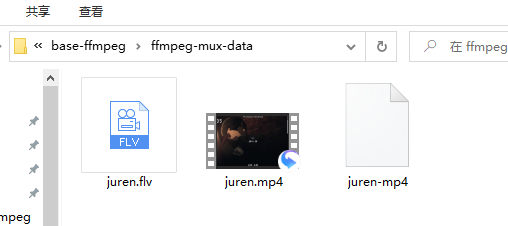

# ffmpeg封装格式转换—FFmpeg基础

<div id="meta-description---">ffmpeg封装格式转换，如何把 MP4 转换成 FLV</div>

本文主要讲解 ffmpeg 的封装格式转换。本文使用的素材资源下载：[百度网盘](https://pan.baidu.com/s/1YataQcYEaGQLVlzb9MMzvA )，提取码：9til 。素材文件如下：

<div align="center">
    
</div>

------

#####  FLV 转 MP4：

```
ffmpeg -i juren.flv juren.mp4
```

#####  FLV 转 TS：

```
ffmpeg -i juren.flv juren.ts
```

##### MP4 转 FLV：

```
ffmpeg -i juren.mp4 juren.flv
```

上面的命令是 封装格式之间的转换，但是实际上会进行编解码转换，例如 MP4 转 FLV，他会先解码 MP4 的数据，然后 选择 FLV的默认的编码格式进行重新编码，FLV 封装格式的默认编码是 H.264，juren.mp4 的编码格式也是 H.264，**所以实际上编码格式没变**，但是还是经过了编解码运算，所以上面那条转封装命令会运行很慢，如下图：


ffmpeg.exe 运行的时候，会有一个日志输出，上图中的 speed 就是处理速度，现在速度是 5 倍，那就是5分钟的视频，处理完成需要1分钟的时间。

为了加快运行速度，我们可以加上 `-c copy`  参数，让 ffmpeg 不进行编解码运算，如下：

##### MP4 转 FLV （不进行编解码）：

```
ffmpeg -i juren.mp4 -c copy juren.flv
```

上面的命令，大家可以自行运行一下，在我的电脑里面 1秒钟都不用，所以 编解码的运算量是很大的，不进行 编解码之后，速度提高了60 倍以上。

------

上面的命令，ffmpeg 都是根据 文件的**后缀名**猜测出封装格式， 素材里面有个 juren-mp4，这个文件是没有后缀名，如果没有 后缀名，ffmpeg 就会 读取一部分的文件内容来判断文件格式。所以 ffmpeg 非常的智能，因为ffmpeg 也是给非开发人员使用的。

对于一些新型的封装格式，ffmpeg 猜测不对，可以指定 封装格式，如下：

```
ffmpeg -f flv -i juren.flv -c copy juren.mp4
```


