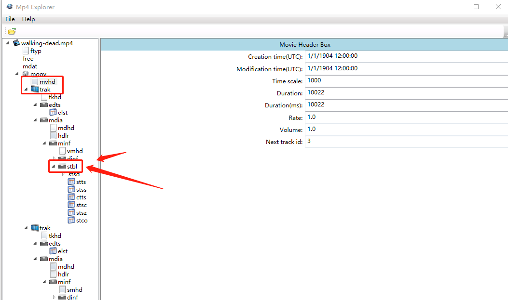
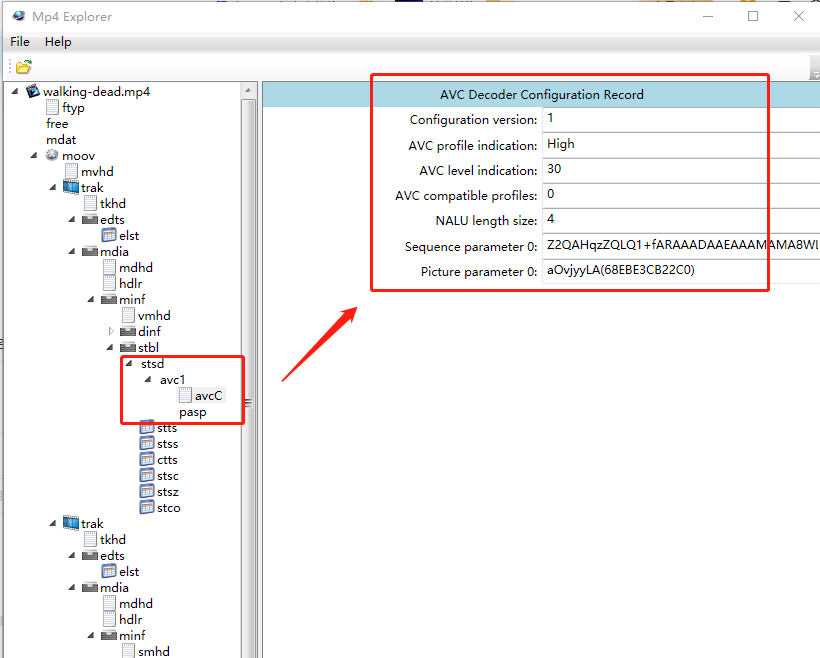
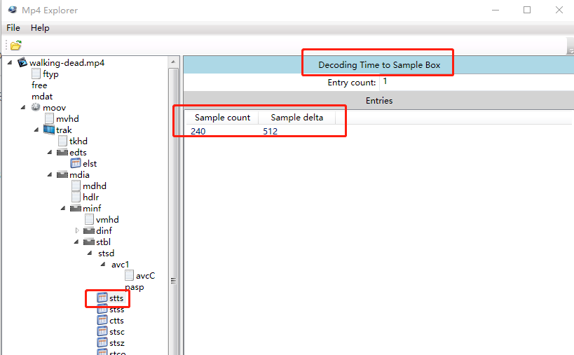
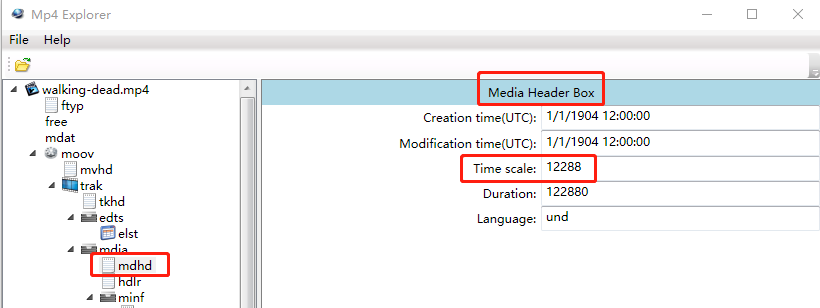
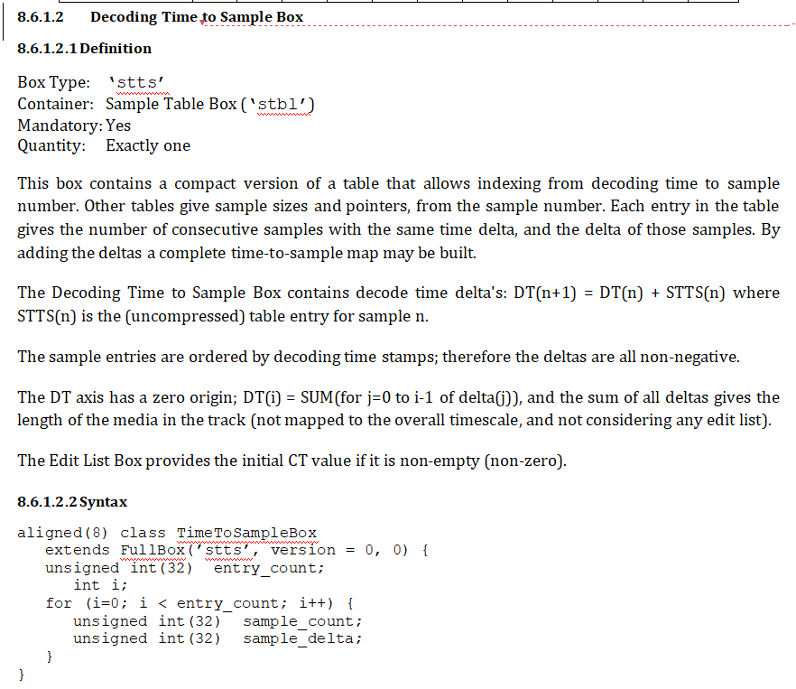
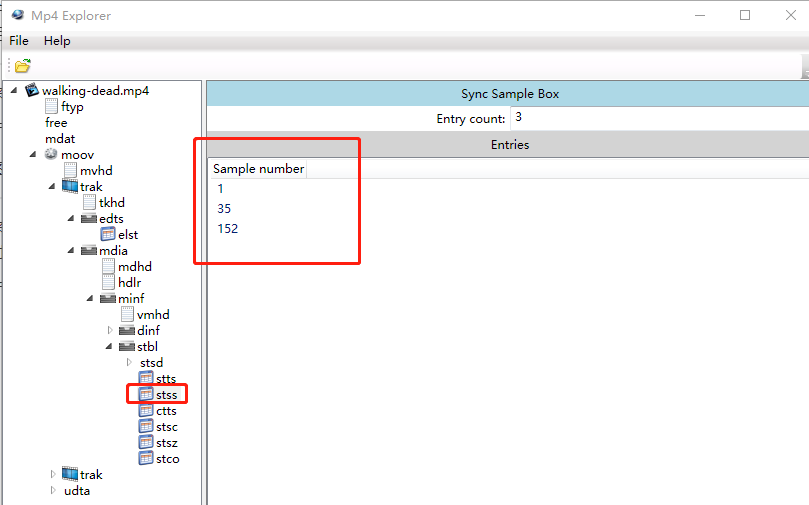
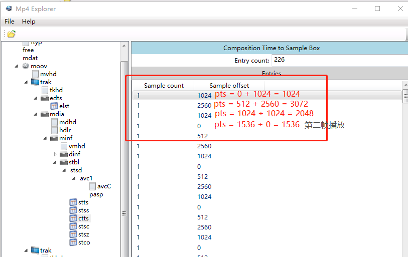
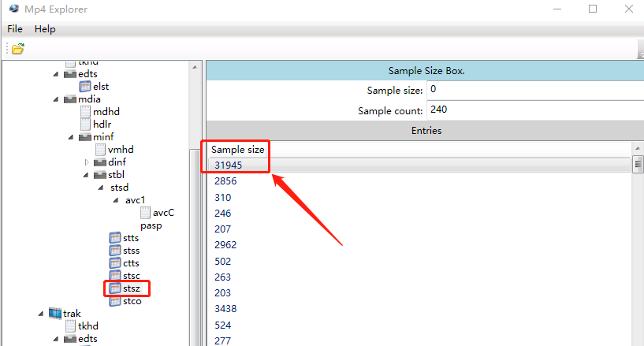
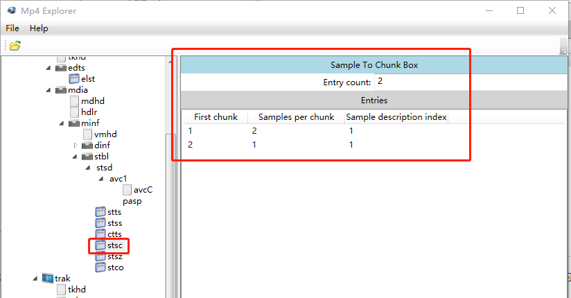

# MP4封装格式—音视频基础知识

<div id="meta-description---">MP4封装格式介绍及解释，本文介绍 mp4 里面各种 box 的作用，包括 mdat box， moov box，mdhd box 等等。</div>

MP4 的封装格式是 基于 [ISO/IEC 14496-12](https://www.iso.org/standard/74428.html) 标准实现的。先来说一下 上面 ISO/IEC 14496-12  这个名字是啥意思。

ISO 全称是  the International Organization for Standardization，国际标准化组织。

IEC 全称是 the International Electrotechnical Commission，国际电工委员会。

这是两个国际组织，流媒体是他们共同的领域，他们会在共同感兴趣的领域进行合作。所以两个组织有时候一起合作，制定一些标准。

14496 其实是 **MPEG-4** 标准的一组协议族，大概有30多个文档，定义了一些编解码标准，容器格式。而 MP4 所用的文档，就是第 12 个文档，标题是 “ISO base media format” （基础媒体格式）。

其实标准文档定义的东西，都是比较宽泛的，他提到的东西，你一定要按照那样实现，没提到的其实可以自由发挥。ISO/IEC 14496-12 是一个基础容器格式，你也可以基于这个标准，开发个 MP5 ，MP6 容器格式自己内部使用。都是可以的。

------

MP4 的背景介绍完了，下面来讲一点实战的东西，还是老套路，分析这种二进制的格式，单纯看文档，会把你看晕，最好的学习方法就是下一个 MP4 格式分析软件，实实在在分析一个 mp4 文件。下载资源如下：

1，Mp4Explorer ，很好用的一个软件。下载链接：[百度网盘](https://pan.baidu.com/s/1y8jJIwG87ZTX_zwN-5jpAA)，提取码：039r 。

2，walking-dead.mp4，下载地址： [walking-dead.mp4](https://github.com/lokenetwork/FFmpeg-Principle/blob/main/videos/walking-dead.mp4) 

------

下载安装完毕之后，用 Mp4Explorer  打开 walking-dead.mp4 文件，截图如下：


PS：图片的 文件名是 a.mp4 ，这是以前的截图，a.mp4 跟 walking-dead.mp4 内容是一样的，我换了个文件名。

从上图可以看出来，MP4 格式 是一个 box 的格式，box 容器 套 box 子容器，box 子容器 再套 box 子容器。看起来跟 json 很像。

Mp4Explorer 这个工具没有显示对应的二进制数据，有点不太好，但是我已经找不到更好的 MP4 格式分析工具了，所以需要借助一下 notepad++ 的二进制插件来分析。请看下图：


首先，解析一个 MP4 文件是这样的，刚开始的 0 ~ 3 字节是 box 的 size （大小），然后 4 ~ 7 字节是 box 的类型。从上图可以看出，walking-dead.mp4  的第一个 box 的大小 是 0x20 字节（包含头部），然后这个是 ftyp 类型的box，至于这 0x20 字节里面是什么内容 就按照 ftyp 类型去解析就行了。

然后第一个ftyp box 是 0x20 字节大小，解析完第一个 box 就马上到 第二个box了，第二个box 的大小是 第 0x20 ~ 0x23 字节 ，第二个box 是一个 free box，自由发挥 box，可以自定义内容。以此类推不断解析。box 里面 可能会再套 box，也是同样的解析方法，前面4字节是大小，后面 4 字节是 box 的类型。

如上图所示，用不同颜色画出了 3个 box。

1. 黑色圈出来的 box 是 ftyp，全称 File Type Box。ftyp 前面的 4个字节是 0x20（16进制）。也就说，这个 ftyp box 是 32 字节的长度，32字节是包含 size 的4个字节的。ftyp 是一级 box，里面没有子box了。
2. 蓝圈圈出来的 box 是 free，只有 8个字节大小，size 占 4个字节，type 占4个字节。
3. 红色圈出来的 box 是 mdata，全称 Media Data，这个box 是最重要的， ffmpeg 封装的 AVPacket 数据就存放在这个box 里面。mdata 前面 4个字节是大小，00 0b 5c 63 , 也就是 这个 mdata 数据有 0x0b5c63个字节。

------

由第一张图可以知道， mdata box 之后就是 moov box，所以 moov 是紧挨着 mdata 的，如何找到 moov box 的位置呢？

如上可知，mdata box 的起始位置是 0x28 ，mdata box 的大小是 0x0b5c63 字节，所以 moov box 的位置等于 0x0b5c63 + 0x28 = 0x0b5c8b。

我们用 notepad ++ 跳转到 0x0b5c8b 看看能不能找到 moov 这个字符。


0x0b5c8b 的位置附近果然能看到 moov 这个字符串，moov 的ASII码是 6d 6f 6f 76。前面的4个字节数据 00 00 26 39 是 moov box的大小。

分析到这里， mp4 的box结构就比较清晰了，很简单，前面4个字节是 size （大小），后4字节是 type （类型），box 里面的数据按照类型继续解析即可。

不过 size 有两个特殊值 0 和 1，请看下图。

- 当size等于0时，代表这个Box是文件的最后一个Box。
- 当size等于1时，说明Box长度需要更多的位来描述，在后面会定义一个64位的 largesize 用来描述Box的长度。


------

下面来重点讲解一些 moov 这个 box 的内部结构，请看下图：



上图 圈出来了 3 个重点 box：

1. mvhd ，全称 Movie Header Box。存储文件的 **时长** 等基本信息。
2. trak，全称 Track Box，通常一个音频流 或者视频流 对应一个 trak box。
3. stbl，全称 Sample Table Box ，

MP4 最重要的就是 stbl，上图的 stbl 里面有一个 box **stsd**，剩下的 6 个 东西，stts，stss，ctts，stsc，stsz，stco 都是**数据表** 。

------

先看 stsd box （全称 **Sample Description Box**） 的内容，如下图：



 stsd box 里面存储的是编码的信息，我们这个文件是 H264 的，H264 也叫 AVC 编码。

------

接下来分析 stts 表，全称 Decoding Time to Sample Box，请看下图：



从上图看出，这个 stts 表只有两列 Sample count 跟 Sample delta 。这里 Sample delta 的单位是 12288，就是 1秒钟分成 12288 份， Sample delta 占了 512 份，所以是 41 毫秒。12288 这个时间度量 定义在 mdhd box 里面，如下：



这个 stts  Box 我也不太熟悉，需要看标准文档，定义如下：



我转述一下 上面文档那段话的意思，首先讲解第一条公式的含义，公式如下：

@@
DT(n+1) = DT(n) + STTS(n)
@@
DT 全称是 Decoding Time （解码时间），n 代表 第几帧，STTS(n) 是 **未压缩** 的表项，我一开始也没看懂这个 **未压缩** 是啥意思。重新看一下 stts 表，这个表是把 240行数据**压缩**成 1行了，所以要理解上面这个公式，需要把 1行数组 重新解压成 240 行。 stts 的 n 就是第几行，也代表第几帧，所以 STTS(n)  代表的是 这帧数据的 Sample delta （播放时间）。所以上面这条公式用中文表达如下：

```
第 5 帧的解码时间 = 第 4 帧的解码时间 + 第 4 帧的播放时间
```

第 4 帧的播放时间 可以通过  **未压缩** 的 STTS(n) 获取到。

stts 表只有两列，这个表的意思是这样的，Sample count 等于 240，Sample delta 等于 512，也就是41毫秒。所以 第 1 ~ 240 帧数据的播放时长都是 41 毫秒，**这种技巧在音视频领域很常见，要记住这种技巧**，他没有定义 240行数据，因为都是相同的，所以直接合并压缩的，留个 240 给你，你就会知道这是最后的下标值。

如果还有第二行数据，例如 Sample count 等于 10，Sample delta 等于 1024，如下：


上图的意思就是 第 241 ~ 250 帧数据的播放时长都是 **82** 毫秒。

---

根据这个 stts 时间表，就很容易根据 时间找到对应的 帧，例如，客户想跳转到第 3秒播放，直接遍历 stts 的各个行就行。找到不超过 3秒 的 stts(n) ，第 N 行数据，然后用剩下的时间 除以 Sample delta 就能找到对应的帧，这样只能找到 第几帧，至于 这帧在文件的什么位置，占多少字节，需要通过 ctts ，stsz，stco 表再找。由于 stts 是解码时间，如果有 B 帧，客户想要的是播放时间，还需要做一些处理。解码时间跟播放时间不会差距太远。

为什么需要这个 `stts` 表来查询 特定时间 对应的帧，为什么不用帧率直接查。

帧率 并不代表 每帧的播放时间是固定的，例如一个视频 10秒钟，一共 240 帧数据，也就是**平均** 1 秒播 24 帧，但是这是平均值，封装格式是允许 前0.5 秒播放16 帧，后 0.5秒播放 8 帧。封装格式每帧的 PTS 是可以自定义的。

------

接下来分析 stss表，全称 Sync Sample Box，叫关键帧表，也叫同步表，因为关键帧可以独立解码，通常用来同步。请看下图：



从上图可以看出， walking-dead.mp4 有 3 个关键帧，分别是 第 1 帧，第 35 帧，第 152 帧。关键帧占的字节 都是比较大的。

------

接下来分析  ctts 表，全称  Composition Time to Sample Box，时间补偿表，因为 stts 里面存储的是解码的时间，不是播放的时间，有 B 帧的时候，解码时间跟播放时间有差距。ctts 表就是记录这个差距的。如下图：



 ctts 表也是只有两列，跟 stts 表一样的套路，如果两行数据一样，就会压缩，只保留最后一个。 PTS = DTS + Sample offset，所以 第 四 行才是播放的第二帧。

------

接下来分析  stsz表，全称  Sample Size Box，采样大小表，代表各帧数据的大小，如下：



同学可以自己看一下， 第 1 帧 第35 帧数据都比较大，因为他们是关键帧。

------

现在我们已经通过 stts 表 了解到 各帧的解码时间，通过 stsz 表知道 各帧的大小，还差 位置就能定位找到各个帧的，位置的信息存储在 stsc 跟 stco 这两个表里面。

先讲 stsc 表，全称 Sample To Chunk Box，也就是 帧 映射到 chunk 的表。MP4 格式定义了 chunk，一个chunk 里面可以有 多个帧，至于为什么要设计一个 chunk 出来，我也不太清楚，知道的同学可以评论留言。

总的来说，就是一个 chunk 可以有一个，或者多个帧，请看下图。



上图中有两行数据，不是说只有两个chunk，而是重复的数据被压缩，同样的套路。

上图中 第一行 的 First Chunk 是 1，Samples per chunk 等于 2，Sample description index 等于 1，意思是 第一个chunk 里面有 两个视频帧。

最后的 Sample description index 字段是指 第几个 Sample Description Box， 也就是 stsd 表，本文件只有 1个  Sample Description Box， Sample Description Box 有可能会有多个。

stsc 后面是省略的了，代表从 第二个 chunk 起，后面的每个chunk 都是只有一个视频帧。因为本视频流一共240帧，第一个chunk里面有2帧，后面的都是1帧，所以计算出来只有239个chunk。

chunk 跟 sample 这个概念比较重要，MP4 索引定位找到某一帧，就是先找到chunk，再找到sample。

------

Sample 到 chunk 的映射了解完了，现在只要 找到 各个 chunk 的位置，自然就能找到 各个帧的位置，这个位置信息在 stco 表，全称 Chunk Offset Box，chunk的位置表，请看下图：


上图中的 Mp4Explorer 显示有点问题，字段名称不是 Sample size ，这个字段不是大小值，而是偏移值，正确的名称是 Chunk Offset 。

从上图可以看出，第一个 chunk 在 walking-dead.mp4 文件的 第 48 字节 的位置，第一个chunk里面有两帧数据。我们用 notepad ++ 跳到 48 的地方，看看具体内容，48 转成 16进制是 0x30，请看下图：


从上图可以看到，0x30 的地方，前面紧紧挨着 mdat，之前说过 mdat 是存储真正的音视频流的 box 。通过上面这些索引数据，我们找到了第一帧视频数据的位置，我们现在来验证一下对不对，打开 之前搭建好的 Qt Creator ffplay 的调试环境（环境搭建可以跳到后面的 ffplay 章节观看），断点调试 查看 第一个 packet的数据。


上图中， 我在 `av_read_frame()` 的位置打了个断点，可以看到读出来的第一个 AVPacket 的 pos 值的确是 48，对应 了 stco 表的 48。AVPacket 的 size 值等于 31945，对应 了 stsz 表的 31945。

再来看一下第一个 AVPacket 的data 里面的数据，如下图。


从上图可以看到 FFplay 里面读出来的 AVPakcet 的 data 字段的数据跟我们在notepad++ 第48字节的位置看到的数据是完全一样的。

第一帧视频的数据位置找到了，那第二帧视频数据怎么找呢？从 stsc 表可以看出，第一个chunk有两帧数据，所以第二个视频帧是紧挨着第一帧的，所以第一帧的位置 48 加上第一帧大小 31945 等于 31993，换算成 16 进制就是 0x7cf9，所以第二帧数据 在文件的 0x7cf9 的位置。如图：


大家可以自行用 qt 打印第二个视频帧的AVPacket的data数据，来验证一下找的 0x7cf9  位置对不对。

------

分析 到这里 可以看出 MP4 与 FLV 的区别，MP4 除了 mdata box 是存储真正的音视频数据之外，其他的box都是辅助表，所以 MP4 有很强的**编辑性**，各种场景的数据查找的性能都很高。FLV 更像一个 单向链表，你想要什么信息，只能遍历查找。MP4不一样，你想查什么，我都整理好 放在各个 box 给你了。你不用遍历。所以MP4格式更像是加了很多索引的数据库，查起来很快。

------

对比 MP4 跟 FLV 可以知道，音视频格式多种多种，FLV 没有 stsz 这个表，但是 FFmpeg 无论是解析 FLV，还是解析mp4，出来的 AVpacket 的size还是可以用的。所以FFmpeg 实际上就是对纷繁复杂的各种格式进行了封装，让编程更通用一点。

------

本文对 MP4 的讲解到这里就完毕，只是讲了比较常用的 box，实际上 MP4 标准定义 Box 类型 超过 70 种，下面推荐一些资料，方便读者深入理解 MP4。

1. 《FFmpeg 从入门到精通》第 3.1章节 "音视频文件转MP4格式"
2. 《FFmpeg 开发基础与实战》第 5.4 章节 “MP4格式”
3. [5分钟入门 MP4 格式](https://www.cnblogs.com/chyingp/p/mp4-file-format.html)
4.  [ISO/IEC 14496-12](https://www.iso.org/standard/74428.html) ，英文水平良好的可以直接阅读标准文档，标准文档比较大 200 多页，但是很齐全，任何一个box 你不太理解用途，直接在标准文档搜索关键词即可。

