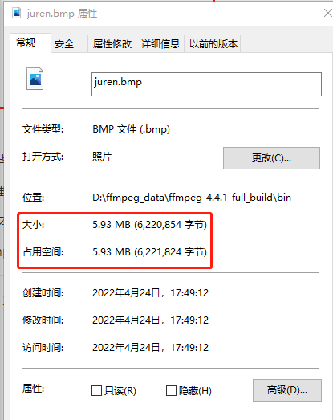
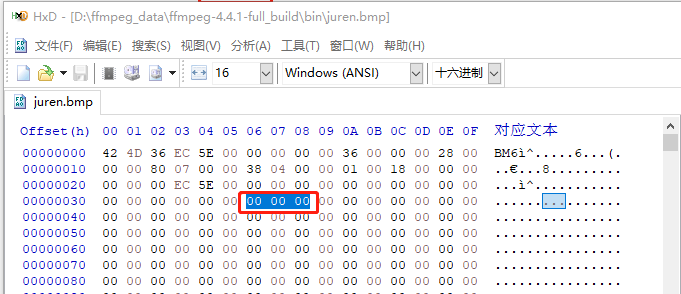
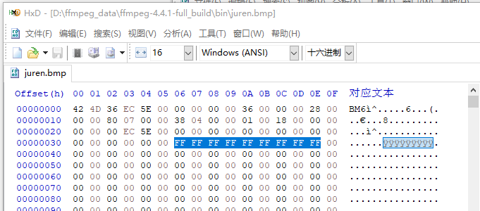
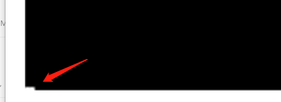

# RGB色彩空间—音视频基础知识

<div id="meta-description---">本文以BMP文件格式为例讲解图像的RGB存储格式的数据布局。什么是真彩色RGB，什么是RGB24。</div>

我们平时接触最多的色彩空间 是 RGB，上学的时候就学过三原色，所有的颜色可以通过三原色产生，这 三原色 就是 Red （红），Green（绿），Blue（蓝）。

做 web 前端的同学也会经常用过 RGB 来指定 页面元素的 颜色。RGB 格式目前主要有两类：

1. 像素格式，这是我们比较常用的格式，R，G，B 分别分开，用N个位来表示。例如 **RGB24格式** 中 R 占 8位，G 占 8位，B 占8 位，所以一个像素占 24位。这种格式可以混合生成 `256 * 256 * 256 = 16,777,216` 种颜色，但缺点是占用空间大。

2. 索引格式，RGB 的值是一个索引，不是真正的颜色值，例如 RGB 的值 占 1位，那只有两个值 0 跟 1，通常用于黑白颜色，这种情况下 一个像素只占 1位，大大节省了空间。0 跟 1 到底是什么颜色，是通过 索引表（也叫调色板）来定位的，不一定是 黑白，也可以是其他的颜色。所以叫索引格式。

   只占 1 位的 RGB 成为 **RGB1**，还有 **RGB4** 占 4 位，索引表有 16 种颜色， **RGB8** 占 8 位，索引表有 256 种颜色。

扩展知识：不需要 索引表/调色板 的 RGB 模式 称为 **真彩色**。

------

#### BMP文件格式概述

比较常见的使用 RGB 模式的文件格式就是 BMP，BMP 全称 Bitmap-File，是微软出的 图像文件格式。所以接下来 讲一下 BMP 的文件格式。

由于 BMP 格式比较简单，所以使用 [HxD](https://mh-nexus.de/en/hxd/) 即可，这是一个 16进制查看器，功能非常强大，用 HxD 打开 juren.bmp 图片，如下：

juren.bmp 下载地址 ：[百度网盘](https://pan.baidu.com/s/1rdbor6CDzho2LDH-6ayMQw )，提取码：k1ow 


BMP 格式 由以下部分组成。

1，BMP文件头(14 bytes) ，存放一些 文件 相关的信息。

2，BMP信息头，通常是 40 bytes 大小，也可以理解成 **图像信息头**，存放一些图像相关的信息，例如宽高之类的数据。

3，调色板，大小由 颜色索引决定，本文的 juren.bmp 是 RGB24 模式，**真彩色**，没有用到 调色板，所以这个区域是0字节。

4，位图数据，对于本文的 juren.bmp 来说，里面就是 RGB 数据，一个像素占 3 个字节。

------

#### BMP文件头

BMP文件头的大小是 14 字节，第 1~2 字节 是 **魔数**，在本文里面是 **BM** 字符串。实际上 这两个字节可以是以下的值：

- **BM：windows**
- BA：os/2 bitmap array
- CI：os/2 color icon
- CP：os/2 color pointer
- IC：os/2 icon
- PT：os/2 pointer

第 3~6 个字节是BMP文件的大小，在本文里面是 0x5EEC36 ，注意，数据类型存储是 小端存储的，看 HxD 的时候，需要从右往左看。0x5EEC36 换算成 十进制 就是 6,220,854 字节，这个值跟 文件属性是可以对得上的，如下图：

<div align="center">
    
</div>


第 7~10 个字节 是保留字节，以后扩展用的，这4个字节目前永远是 0 。

第 11~14 个字节 是实际的像素数据的偏移值，在本文里面是 0x36 ，没有调色板通常都是 0x36，所以从 54 字节开始，就是真正的 RGB 数据。

------

#### BMP信息头

BMP信息头 是从 第 15 个字节开始的，前面 14 个字节 被 BMP文件头 用了。第 15 ~ 18 字节是 BMP信息头 的大小，本文的 juren.bmp 的 第 15 ~ 18 字节 是 0x00000028 ，所以是 40 字节大小（包含自身），如下图：


HxD 这个软件特别棒，你只要选择内容，他就自动转成 十进制给你看。

第 19~22 字节 是 图像的**宽度**，单位是像素，在本文是 0x00000780 , 十进制是 1920 ，也就是 **一行**里面有 1920 个像素。

第 23~26 字节 是 图像的**高度**，单位是像素，在本文是 0x00000438 , 十进制是 1080，也就是 **一列**里面有 1080 个像素。高度是有符号的，可能是负数，负数的情况本文不讲解。

第 27~28 字节是 color planes 的数量 ，通常是 01 。

第 29~30 字节是 指每个像素 需要多少 位来存储，本文是 0x0018 ，十进制是 24 ，所以本文的 juren.bmp 是 **RGB24** 模式的，一个像素占 24 位。

第 31~34 字节是 压缩类型，本文没有压缩，所以是 0 。

第 35~38 字节是 图像大小，不包含 BMP文件头 跟 BMP信息头，其实 BMP文件头就有 总文件大小，6,220,854，减去 54 头部数据，跟 这 4 字节内容是一致的。如下图：


第 39~42 字节是 **Width** resolution in pixels per meter，水平分辨率，本文是 00 ，所以不管他。

第 43~45 字节是 **Height** resolution in pixels per meter，垂直分辨率，本文是 00 ，所以不管他。

第 46~49 字节是 颜色表中的颜色索引数，本文没有索引表，是真彩色，所以是 00 。

第 50~53字节表示对图像显示有重要影响的颜色索引数码，本文是 00 ，代表全都重要。本文没用到索引表，不用管这个字段。

------

#### RGB数据介绍

至此，`juren.bmp` 文件的 BMP文件头，BMP信息头，已经讲解完毕，剩下的字节内容就是 真正的 RGB 值。请看下图中第一个像素的值：

<div align="center">
    
</div>

上图中圈出来的像素 是 R等于00 ，B等于00，G等于00 ，所以是一个纯黑色的像素，注意，这个像素是位于 **左下角**的第一个像素，不是 **左上角**。

文件中的像素排列顺序是从左下角到右上角，这个排列顺序是由 BMP信息头 里面那个 高度是正数还是负数决定的。

下面我们手动修改一下 这些颜色，把黑色改成 白色，如下图：

<div align="center">
    
</div>

我把 左下角 3 个像素全部改成 白色了，放大再看一下 juren.bmp ，可以看到有白色的3个像素，只是非常小，如下图：

<div align="center">
    
</div>

注意，RGB24 模式中的顺序是 BGR，第一个字节是 B，第二个字节是 G， 第三个字节才是 R。

RGB24 真彩色占用的存储空间是很大的，`juren.bmp` 占了 5M 大小，从HxD 可以看到有很多重复的像素点，是一样，这些都是可以压缩的。

------

#### FFmpeg处理bmp文件

FFmpeg 可以自由 转换 jpeg 跟 bmp，命令如下：

```
ffmpeg -i juren.jpg juren.bmp
```

```
ffmpeg -i juren.bmp juren.jpg
```

------

参考文章：

1，[Exploring the .BMP File Format](https://www.cs.ou.edu/~rlpage/secollab/20projects/BMPexplained.pdf)

2，[图片RGB数据格式](https://yangandmore.github.io/2019/03/27/%E5%9B%BE%E7%89%87RGB%E6%95%B0%E6%8D%AE%E6%A0%BC%E5%BC%8F/)

3，[BMP文件格式详解（BMP file format）](https://www.cnblogs.com/Matrix_Yao/archive/2009/12/02/1615295.html)

4，[A Bitmap File Analyzer](http://www.flounder.com/bitmapinfo.htm#Displaying%20the%20bitmap)
