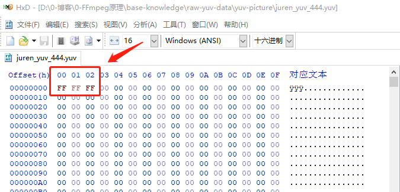
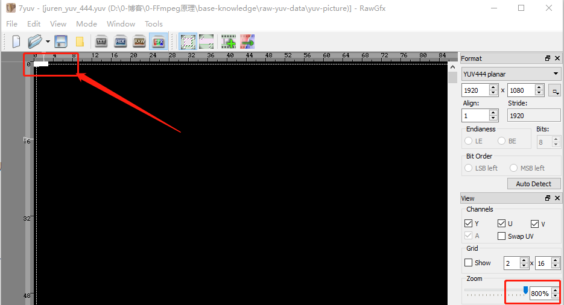
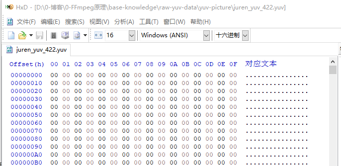
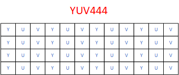
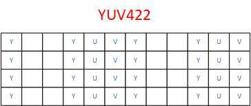
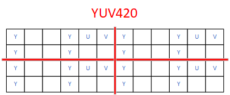

# YUV数据分析—音视频基础知识

<div id="meta-description---">对于人类视觉系统，为什么 YUV 比 RGB 跟容易压缩，YUV 是如何压缩的。YUV444，YUV422，YUV420 的存储格式。 </div>

在 前文中，已经知道 YUV 色彩空间非常适合存储跟传输，本文就用实战的方式来演示一下，YUV 在存储跟传输领域有哪些优点。

首先 YUV 有 3 种采样模式：

1，4:4:4 ，一个像素 占 3 个字节。

2，4:2:2，平均一个像素占 2 个字节。

3，4:2:0，平均一个像素占 1.5 个字节。


------

请先下载下面要用到的图片资源，[百度网盘](https://pan.baidu.com/s/191b-NCPOGCt7ryVwX8sc2Q )，提取码：ea7s 。资源文件中的 yuv 图片是我用以下 FFmpeg 命令转出来的，

```
ffmpeg -i juren.jpg -s 1920*1080 -pix_fmt yuvj444p juren_yuv_444.yuv
ffmpeg -i juren.jpg -s 1920*1080 -pix_fmt yuvj422p juren_yuv_422.yuv
ffmpeg -i juren.jpg -s 1920*1080 -pix_fmt yuvj420p juren_yuv_420.yuv
```

文件内容如下图：


从上图可以看到，yuv420 比 yuv444 的 数据量少了一半，我们用 [7yuv](http://datahammer.de/) 看一下图片质量的差异，再次推荐一下 7yuv， 这是一个 raw 图片编辑器，RGB ，YUV 数据都能用 7yuv 来查看编辑。


上面两张 图片，大家能看出来有什么区别吗？我个人的感受是没有区别，这就是针对 人眼系统 使用的技巧，他的信息量确确实实 少了一半，但是你的眼睛能看到数据少了一半吗？我们感受不到，感受不到就不算少了。

**重点：YUV420 比 YUV444 少了一半数据，视觉体验几乎没有变化。**

提醒：使用 7yuv 的时候，Format 跟 宽高 一定要选对，图片才会显示正确。

由于大多数视频编码使用的是 YUV420，所以我们经常说的 视频分辨率，是指他的**亮度分辨率**，因为只有亮度才是铺满的，UV 不是。

------

先用 HxD 来看一下 juren_yuv_444.yuv 图片 实际的存储情况，请看下图：


这里我得着重讲一下，YUV 这种格式，我觉得他是 裸数据中的裸数据，太裸了，yuv 格式的文件，不像 BMP 文件，BMP 虽然里面也是 RGB 的裸数据，但是 BMP 里面有一些头数据，宽高什么的。

但是 yuv 文件格式，没有头信息，没有宽高信息，所以用 7yuv 打开 YUV 文件的时候，需要指定宽高，要指定采样格式是 4:4:4。如果你有一个 yuv 图片，但是你忘记了 它的宽高跟采样格式，那你就无法正常显示这个 yuv 图片。

所以，yuv 图片文件除了 原始的像素数据，什么都没有的。由于 4:4:4 跟 RGB24 一样，每个像素占 3 字节，图片宽高是 1920x1080 ，所以这个 yuv 图片的大小如下：
@@
SIZE = 1920 * 1080 *3
@@
所以这个  juren_yuv_444.yuv 图片一共是 6075 Kb 大小。

------

YUV 格式有3大类 ：

**1，planner ：**平面格式， 先连续存储所有像素点的Y，紧接着存储所有像素点的U，随后是所有像素点的V。

注意：这里的连续存储，不是一行像素里面连续存储，是整张图片的连续存储，例如 本文的 juren_yuv_444.yuv 图片是 6075kb 大小，那第 1~ 2025kb 都是 Y 的数据， 2026 ~ 4050kb 都是 像素点的 U 数据，以此类推。

**2，semi-Planar**：半平面的YUV格式，Y分量单独存储，但是UV分量交叉存储。

**3，packed** ：每个像素点的Y,U,V是连续交错存储的。

上面 `FFmpeg` 命令把 `jpeg` 转 `yuv` 的时候，使用的格式是 `yuvj444p`，后面的 `p` 就代表 `planner`，所以 本文只关注 **planner格式**，其他格式不讲。

yuv 图片的像素存储顺序 是从 左上角 到 右下角的。所以如果我们想把 图像的左上角3个像素改成 白色，只需要 把前面 3 字节 从 0 改成 255 即可。Y 是亮度，最亮的值就是白色。如下：

<div align="center">
    
</div>

用 7yuv 放大图片查看，左上角果然出现了 3个白色像素。

<div align="center">
    
</div>

至此 yuv444p 的存储格式讲解完毕。

------

下面来讲一下 yuv422p 的存储格式，422 比 444 采样格式 少了 三分之一的数据量。请看下图：

<div align="center">
    
</div>

上图 是 用 HxD 打开的效果，前面依然是一堆 00 00 ，因为 是 planner 模式，前面的 2025kb 还是 Y，只是 后面的 UV 少了一半的数据量。

我们知道，YUV 转 RGB 的是时候，肯定需要 知道 Y ，U 跟 V 的值，现在 UV 少了一半，怎么分？

是这样分的，第一个像素跟第二个像素 共享一个UV。这里要提及一下 422 格式里面的 U 值是新值，是由第一个像素跟第二个像素的 U 值加起来除以 2 得到的，所以 422 格式的 UV 值 其实是平均值。

所以，422 格式，是第一第二个像素共享 一组UV，第三第四像素共享 一组 UV，以此类推，如下图：

<div align="center">
    
</div>


<div align="center">
    
</div>

上图中的空白格代表不占空间，画出来只是为了方便理解，图中的存储顺序不是 planner 格式，也是为了方便理解。

大家可以数一下 上面 两张图片的格子（不包含空格子），会发现 YUV422 确实 比 YUV444 少了 三分之一 的格子。

------

最后讲一下 数据量最少的 YUV420 格式，这个格式也是应用最广泛的的，视频会议，数字电视，DVD，都用的 YUV420 格式。请看下图：

<div align="center">
    
</div>

从上图可以看出，第一行的第1，第2 像素，第二行的 第1，第2 像素共用一组 UV，以此类推。为什么不是 第一行的 第 1~ 4 个像素共享 一组 UV，这是因为如果这样搞，空间距离太远，容易造成体验不太好。换行共享 UV 的空间距离短，画面过渡会自然一些。

这些 UV 值都是新值，是以前的 4 个像素的 U 值加起来 除以4 的平均值。

其实有好几种求 UV 值算法。

1，平均值，4 个像素的 U 值加起来 除以4。

2，加权，例如第一第二个像素的U权重大点，第三第四个像素的U权重小一点。

3，直接丢弃 第二，第三，第四个像素的 U值，取 第一个 像素的 U 值。V值同理。

我个人觉得求 平均比较靠谱，FFmpeg 的代码也有这个算法，具体是求平均还是 加权，我要看下源码，这里埋个坑，后面填。

