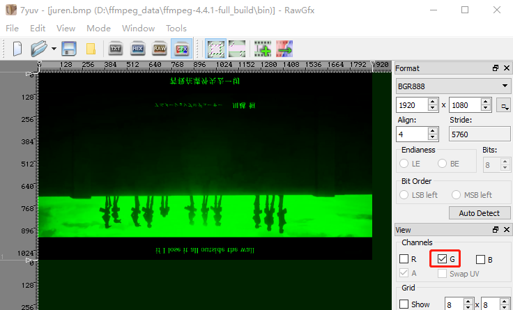
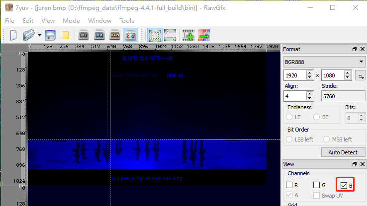
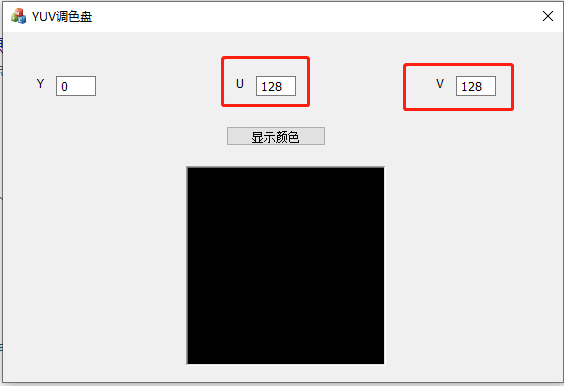
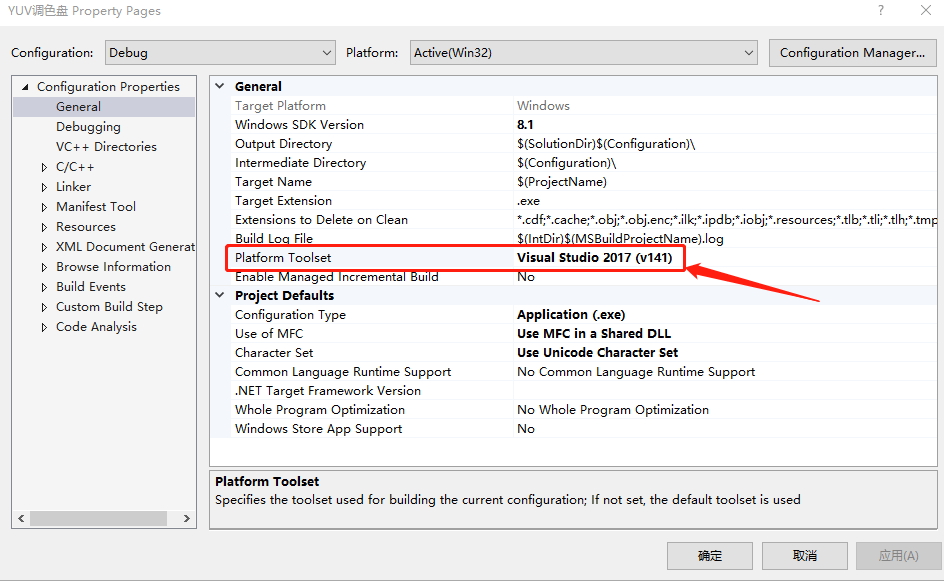

# YUV色彩空间—音视频基础知识

<div id="meta-description---">本文介绍 YUV存储格式，什么是色调？什么是色饱和度？人类视觉系统是如何感知YUV的？YUV比RGB好在哪里</div>

虽然日常生活中接触得比较多的是 RGB 色彩空间，但是还有另一种比较常用的色彩空间 是 YUV。RGB 色彩空间更适合图像采集和显示， YUV 空间用于编码和存储则比较好。在存储和编码之前，RGB 图像要转换为 YUV 图像，而 YUV 图像在 显示之前通常有必要转换回 RGB。

这里显示的时候 YUV 转成 RGB 通常是硬件或者软件内部做了，我们写代码开发的时候 这个 YUV 转 RGB 显示到屏幕这个过程通常是**透明的**。

无论是 RGB 还是 YUV ，**他们都是 表达 色彩信息的一种方式**。

可以把 RGB 跟 YUV 色彩空间看成是 一个 xyz轴 的立方形，一个三维的空间。

------

首先，讲一下为什么 YUV 色彩空间 在音视频开发，编码压缩领域更加常用，这个涉及到 HVS （Human Visual System）人类视觉系统 对 色彩空间的感知能力。

视觉心理学研究表明，人的视觉系统对光的感知程度可以用两个属性来描述：**亮度（luminance）**跟 **色度（chrominance）**，这里的色度也叫做 饱和度或彩度，总之 色度的叫法有很多，要注意上下文来区分语义。

然后 **色度感知** 包含两个维度：**色调**（Hue）和 **色饱和度**（saturation）。色调是由光波的峰值定义的，描述的是光的颜色。色饱和度是由光波的谱宽定义的，描述的是光的纯度。

因此 HVS 对色彩的感知主要有 3个属性：亮度（luminance），色调（Hue）和 色饱和度（saturation）。也就是 YUV 色彩空间，Y 代表 亮度，U代表色调，V代表色饱和度。

经过大量研究实验表明，**视觉系统 对 色度 的敏感度 是远小于 亮度的**。所以可以对 色度 采用更小的采样率来压缩数据，对亮度采用正常的采样率即可，这样压缩数据不会对视觉体验产生太大的影响。简单来说就是用更少的数据/信息来表达 色度（chroma），用更多的数据/信息来表达 亮度（luminance）。

YUV 针对 HVS 的压缩技巧请阅读[《YUV数据分析》](https://ffmpeg.xianwaizhiyin.net/base-knowledge/raw-yuv-data.html)

------

下面用实际的例子要演示一下 HVS 是怎么感知 YUV 3个分量的，下载 <a href="./raw-yuv/meigui_yuv_444.yuv" target="_blank">meigui.yuv </a>，用 [7yuv](http://datahammer.de/) 打开，请看下图：

下图中，我只勾选了 Y 分量显示，可以看到是一个黑白图像，**Y 是亮度，黑色越亮就会变成灰色，灰色越亮就会变成白色。**


再看下图，这次我勾选 了 Y跟U 两个分量，注意看叶子跟花朵，可以看出来，已经能看到绿色跟红色了，但是他们非常原始，是暗红跟暗绿的颜色。


最后，我把 V （色饱和度）也勾上，可以看到，暗红 变成了玫瑰红，暗绿 变成了 青绿色。


------

YUV 其实目前有 三种分类：

1，YIQ 适用于NTSC彩色电视制式

2，YUV 适用于PAL和SECAM彩色电视制式

**3，YCbCr 适用于计算机用的显示器**

我们做互联网音视频开发， 一般说的 YUV 是 指  **YCbCr** ，U 就是 Cb，V 就是 Cr。

大家经常在一些音视频书籍看到 YCbCr ，把它当成是 YUV 就行。**实际上 YCbCr 才是比较准确的术语**，JPEG、MPEG 标准 用的也是 YCbCr 。

本书后面说讲的 YUV 也是指  YCbCr ，不是指 用于PAL和SECAM彩色电视 的 YUV。、

------

为什么 RGB 色彩空间不符合 HVS 的感知能力，现在提供一个<a href="./raw-yuv/juren.bmp" target="_blank">juren.bmp</a> 图像，里面是 RGB24 真彩色数据。用 [7yuv](http://datahammer.de/) 打开，如下图：

<div align="center">
    
</div>

<div align="center">
    
</div>

<div align="center">
    
</div>


上面 3 张 图片，分别展示了 R，G，B 分量的显示情况，**可以看到 3 个 分量都跟 亮度密切相关**，所以针对 HVS 的压缩技巧，在 RGB 色彩空间 不方便使用。

由于相机采集的时候都是 RGB，所以需要一种方法，把RGB色彩空间转换 YUV 空间，《[RGB与YUV相互转换](/base-knowledge/raw-yuv-to-rgb.html) 》文章有详细讲解。

------

扩展知识：实际上，黑白电视看着也不赖，实时通信领域，考虑实时性，降低成黑白也是一个解决方案。

------

接下来 讲一下 CbCr 这两个通道信息，会用动画跟图片 演示 这两个数值变换带来的视觉影响，如果没有动画跟图片，读者不太容易理解这两个通道是什么。

YUV 里面的 U 就是 Cb ，术语是 **色调**（Hue）。V 就是 Cr ，术语是 **色饱和度**（saturation）。

实际上你可以把 UV 看成是 ，colour difference （色彩的差异），请看下图三条公式：
@@
Cb = Blue - Y
@@
@@
Cr = Red - Y
@@

@@
Cg = Green - Y
@@

Cb 代表 蓝色 色度的分量，是通过 RGB 里面的 B 的值 减去 Y 的值得到的。

Cr 代表 红色 色度的分量，是通过 RGB 里面的 R 的值 减去 Y 的值得到的。

Cg 代表 绿色色 色度的分量，是通过 RGB 里面的 G 的值 减去 Y 的值得到的。

Cb 跟 Cr 的颜色空间 如下图（高清图）：

<div align="center">
    
</div>

为了直观感受 CbCr 值的影响，需要使用一个 YUV 调色板来演示一下，如下图：

<div align="center">
    
</div>

上图中，YUV 的值都是 1 ~ 255 ，所以 128 就是上图 x y轴的中心。大家可以试着把 Y 从 0 改成 255，会越来越**亮** ，直到变成白色。

 YUV 调色板 下载地址：[百度网盘](https://pan.baidu.com/s/1tLXTDE1lWixsTNrXyi799Q )，提取码：7x1n 。

这个调色板是 [岳麓吹雪](https://lin-lz.blog.csdn.net/) 用MFC 写的，需要安装 VS2017 跟 MFC 组件，因为这个项目比较旧，需要改一下配置，如下图，把 Platform Toolset 换成 v2017，

<div align="center">
    
</div>

调色板里面的 U 就是 Cb，这个值 就是 彩色空间 x 轴的偏移位置，也就是差值，偏移这么多就能达到想要的颜色。但是 还有 Y 轴，Y 轴是 Cr。Cb 跟 Cr 是组合的，会互相影响最后的颜色。

所以， Cr 跟 Cb 在 X Y 轴的图片上看，就会很容易理解他们的作用。


------

参考文章：

0，《数字编码技术原理》- 高文

1，色度 (色彩学) - 维基百科

```
https://zh.wikipedia.org/wiki/%E8%89%B2%E5%BA%A6_(%E8%89%B2%E5%BD%A9%E5%AD%A6)
```

2，[YCbCr](https://en.wikipedia.org/wiki/YCbCr) - 维基百科

2，[YCbCr与YUV的区别](https://blog.csdn.net/machh/article/details/51799403)

  
