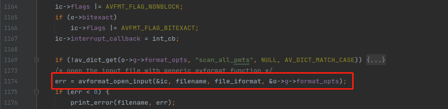

# FFmpeg命令行参数分析-pix_fmt—ffmpeg.c源码分析

<div id="meta-description---">xxx</div>

`pix_fmt` 参数的全称是 pixel foramt（像素格式），定义如下：

```
{ "pix_fmt", OPT_VIDEO | HAS_ARG | OPT_EXPERT  | OPT_STRING | OPT_SPEC | PT_INPUT | OPT_OUTPUT,             { .off = OFFSET(frame_pix_fmts) }, "set pixel format", "format" }
```

从 `OPT_INPUT` 与 `OPT_OUTPUT` 两个属性可以知道，`pix_fmt` 参数可以作用于输入文件，也可以作用于输出文件。

---

#### pix_fmt 参数作用于输入文件

当 `pix_fmt ` 参数作用于输入源的时候，通常是因为输入源是 yuv 数据，yuv 格式是没有头部来记录像素格式的，所以你需要指定像素格式 以及 宽高 才能正确解析输入源，具体的命令如下：

```
ffmpeg -s 1920x1080 -pix_fmt yuv420p -i juren-10s.yuv juren-10s.mp4
```

命令素材可以在 [百度网盘](https://pan.baidu.com/s/1fu17bY7bPZx_qXShEialnA?pwd=0uow ) 进行下载。

当 `pix_fmt` 作用于输入源的时候，它的实现原理如下：

1. 把 `pix_fmt` 参数的值赋值到 `OptionsContext` 结构的 `frame_pix_fmts` 字段
2. 把 `frame_pix_fmts` 赋值到 `o->g->format_opts`
3. 把 `o->g->format_opts` 传递给 `avformat_open_input()` 函数打开输入源

代码如下：




----

#### pix_fmt 参数作用于输出源

当 `pix_fmt ` 参数作用于输出源的时候，它的作用是对输入文件的像素格式进行转换，例如把 yuv420p 转换成  rgb24 输出，命令如下：

```
ffmpeg -i juren-10s.mp4 -pix_fmt rgb24 juren-10s-new.mp4
```

`juren-10s.mp4` 是 yuv420p 编码之后的视频，而 `juren-10s-new.mp4` 是 rgb24 编码之后的视频。

当 `pix_fmt ` 作用于输出源的时候，它的实现原理如下：

**1，**把 `pix_fmt ` 参数的值赋值到 `OptionsContext` 结构的 `frame_pix_fmts` 字段，常规操作

**2，**把 `frame_pix_fmts` 赋值给编码器参数，因为编码器需要知道自己编码的视频数据是什么格式的，代码如下：


**3，**根据编码器参数 `enc_ctx->pix_fmt` 来设置 `OutputFilter` 的 `format`，如下：


注意：上图这个 `OutputFilter` 里面会是一个 `buffersink` 的 滤镜，用来连接输出流 `OutputStream` 的。

---

**4，**当 `OutputFilter` 的 `format` 被设置的时候，就会创建 `format` 滤镜来进行像素格式转换，如下：


`format` 滤镜有时候是自动创建的，不需要在命令行手动指定 `-pix_fmt`。`ffmpeg.c` 的逻辑会自动选择一个编码器支持的像素格式进行转换。 因为从 滤镜出来的 `AVFrame` 最终是要发送给编码器进行编码的，所以必须要看编码器支不支持这种格式。

---

**5，**用 `buffersink` 的输出像素格式重新设置编码器参数，如下：


这是比较绕的一步，因为前面已经设置过了 编码器 的 像素格式参数了，这里又设置一遍，是为什么呢？

我估计是这样的，因为 `-complex_filter` 或者 `-vf` 命令行参数也可以直接指定 `format` 滤镜，这个有可能会把 `-pix_fmt` 的效果覆盖掉。

所以编码器最终的像素格式是通过 `buffersink` 来决定的，这是合理的，因为编码器的数据，就是由 `buffersink` 来输入的。

《[FFmpeg命令参数分析-ac](https://ffmpeg.xianwaizhiyin.net/ffmpeg/cmd_arg_ac.html)》与 《[FFmpeg命令参数分析-pix_fmt](https://ffmpeg.xianwaizhiyin.net/ffmpeg/cmd_arg_pix_fmt.html)》的实现是非常类似的。

