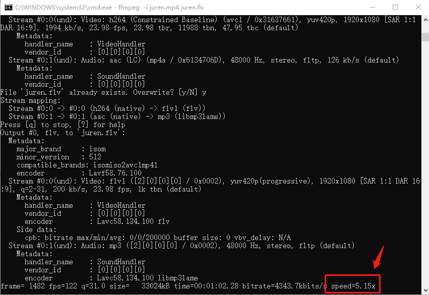

# FFmpeg命令行参数分析-re—ffmpeg.c源码分析

<div id="meta-description---">re 的全称是 rate emulator（速率模拟），可以用这个选项来模拟输入的速度</div>

`re` 的全称是 rate emulator（速率模拟），可以用这个选项来模拟输入的速度。因为 `ffmpeg.exe` 默认情况下是尽量以最快的速度来读取输入数据，具体多快，取决于 CPU 的性能。

下面这条命令就是未使用 `-re` 的场景，可以看到，速度是 5 倍速。

```
ffmpeg.exe -i juren.mp4 juren.flv
```



现在我们加上 `-re` 选项之后的效果如下：

```
ffmpeg.exe -re -i juren.mp4 juren.flv
```


可以看到加上 `-re` 选项之后，处理速度变成了一倍速。

##### 一倍速意味着什么呢？

它意味着处理完 2小时的视频，就需要 2小时。从另一个角度来解释，如果这个视频是 1 秒 24 帧的视频，那就是 `ffmpeg.exe` 会每隔 40 毫秒从输入文件读取一个 `AVPacket` 进行处理。

如果你不加 `-re`，`ffmpeg.exe` 处理完一个 `AVPacket` 就会立即去读下一个 `AVPacket`，它不会等够 40 毫秒。

`-re` 在推直播流的时候非常有用，当你需要将一个 `mp4` 推送到 `rtmp` 服务器，基本都会加上 `-re` 来模拟摄像头采集画面的速度。

---

下面就让我们来学习一下在 `ffmpeg.c` 里面是怎么实现 `-re` 模拟速率的功能的。

`-re` 的定义如下：

```
{ "re", OPT_BOOL | OPT_EXPERT | OPT_OFFSET | OPT_INPUT, { .off = OFFSET(rate_emu) },
```

`.off = OFFSET(rate_emu)` 这句代码是重点，代表这个 `-re` 会赋值给 `OptionsContext` 结构里面的 `rate_emu` 字段，由于 `-re` 是 `OPT_BOOL`（布尔类型），所以 `OptionsContext::rate_emu` 会被设置为 1。

##### `rate_emu` 字段在哪里被使用呢？

如下：


在 `ffmpeg_opt.c` 的 `open_input_file()` 函数里把 `OptionsContext` 里面的 `rate_emu` 赋值给了 `InputFile` 的 `rate_emu`。

然后，如果  `InputFile` 的 `rate_emu` 被设置为 1，会导致 `input_streams` 的 `start` 字段被设置，如下：


**`input_streams` 的 `start` 字段字段代表什么意思呢？**

它代表什么时候开始读取 AVPacket。

---

然后在 `get_input_packet` 获取 `AVPacket` 的时候，就会根据这个 `start` 字段，计算当前任务已经运行了多久，跟 `input_streams` 的 dts 字段进行比较，如果 运行时间小于 `input_streams` 的 `dts`，就会返回 `EAGAIN`，如下：


**`input_streams` 的 `dts` 是什么意思？**

它记录的是最后一个从输入文件读取出来的 `AVPacket` 的 dts，如下：


这几个时间变量如果细细研究，是有点绕的。不过也可以不用细究。我举个简单的例子，例如现在 `ffmpeg.exe` 启动了 80 毫秒，他已经读到了第 3 帧视频，第三帧的视频的 `dts` 是 120 毫秒。

所以，此时此刻，上图中的 `now` 就等于 80 毫秒，而 `pts` 就 等于 120 毫秒，代码如下：

```
for (i = 0; i < f->nb_streams; i++) {
    InputStream *ist = input_streams[f->ist_index + i];
    int64_t pts = av_rescale(ist->dts, 1000000, AV_TIME_BASE);
    int64_t now = av_gettime_relative() - ist->start;
    if (120 > 80)
    	return AVERROR(EAGAIN);
}
```

120 大于 80，所以就会返回 `EAGAIN`，继续等待。当 `ffmpeg.exe` 运行足够久了，`now` 就会变成大于 120 的值，就会继续去读 `AVPacket` 进行处理。

不过需要注意的是，他上面这段代码，是遍历一个输入文件里面的所有流的，**也就是音频流，视频流，都会做速率模拟**。只要有其中一个流不符合速度，就会返回 `EAGAIN`

通常情况下，音频流的速度是采样率决定的，视频流的速度是帧率决定的。


