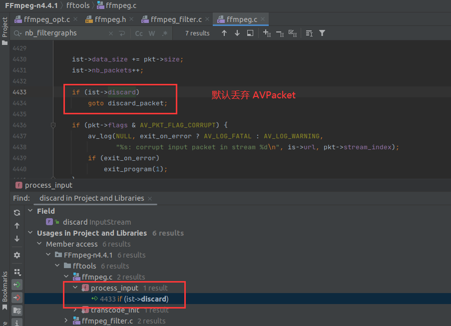

# 音频流是如何被丢弃的—ffmpeg.c源码分析

<div id="meta-description---">当封装格式不支持 音频流的时候，ffmepg.c 是如何自动删除音频流的？</div>

请先看一下下面这条命令：

```
ffmpeg -i juren.mp4 -t 10 -pix_fmt yuv420p juren-10s.yuv
```

`juren.mp4` 文件原本是有音频流，但是输出文件是 `yuv` 格式，并不能存储 音频数据，而且也没有使用 [-an](https://ffmpeg.xianwaizhiyin.net/ffmpeg/cmd_arg_an.html) 选项把音频流去掉，那在 `ffmpeg.c` 里面是怎么自动把 音频流 删除的呢？这就是本文要讲解的内容。

---

`ffmpeg.c`  里面会调用 `av_guess_codec()` 获取  `muxer` 默认的音频流的编码器，如果 这个 `muxer` 类型不支持存储音频流，`av_guess_codec()` 会返回 `AV_CODEC_ID_NONE`。

我这里说的 `muxer` 就是指 yuv muxer。

具体代码如下：


从上图可以看出来，由于 `av_guess_codec()` 返回 `AV_CODEC_ID_NONE`，所以不会执行 `new_audio_stream()`，因此输出文件就是没有音频流的。

而输入文件的音频数据是怎么丢弃的，请阅读《[FFmpeg命令参数分析-an](https://ffmpeg.xianwaizhiyin.net/ffmpeg/cmd_arg_an.html)》，实际上下面两条命令是等价的：

```
ffmpeg -i juren.mp4 -t 10 -pix_fmt yuv420p juren-10s.yuv
ffmpeg -i juren.mp4 -t 10 -pix_fmt yuv420p -an juren-10s.yuv
```

这两条命令，在 `ffmpeg.c` 里面的运行逻辑完全一样，都是把 输入文件的 音频 AVPacket 读取出来之后，就直接丢弃了，如下：


