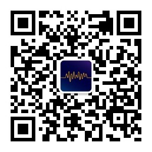

# Introduction to FFmpeg Principles

The book "Principles of FFmpeg" primarily explores the theoretical foundations of FFmpeg. It begins with chapters on the fundamentals of audio and video development, as well as streaming media technology. Later chapters delve into the setup of various debugging environments for FFmpeg and offer practical examples of using FFmpeg API functions. A key focus is the in-depth analysis of the source code logic of ffmpeg.c and ffplay.c.

*Created via postermywall*

This book **"Principles of FFmpeg"** mainly explains the theoretical knowledge of FFmpeg. The first few chapters mainly cover some basic knowledge of audio and video development, such as raw data YUV and RGB, encapsulation formats FLV and MP4, basic concepts of compression encoding, and encapsulation format analysis.

The initial chapters are about the basics of audio and video development and streaming media technology. The later chapters mainly explain how to set up various debugging environments for FFmpeg, while also providing examples of using FFmpeg API functions. Most importantly, it analyzes the source code logic of ffmpeg.c and ffplay.c.

Although the official documentation does not provide very detailed API function tutorials, the official provides the `ffmpeg.c` file. Most of the usage of API functions is in the source code of this file.

All the functionalities of **FFmpeg command-line** that you use are implemented in `ffmpeg.c`._Format conversion_, _encoding format conversion_, _merging video streams_, _various filtering functions_, and more, all can be found in `ffmpeg.c`.

This book will analyze the internal logic of `ffmpeg.c` in many chapters, allowing readers to understand the usage of FFmpeg API comprehensively. After forming a systematic understanding of the FFmpeg API, even if the new version of FFmpeg modifies the usage of API functions, you can quickly learn the usage of new version API functions from `ffmpeg.c`.

**Note: All images in this book are high-definition. Please directly open the images in a new tab.**

**Note 2: The first edition is based on FFmpeg-n4.4.1 source code analysis.**

---

If you want to subscribe to updates of this book, you can follow the official account **FFmpeg Notes** or subscribe to the [Channel](https://t.me/ffmpeg_principle) on Telegram.

    

Due to the author's limited proficiency and simultaneous involvement in development work, there may inevitably be some errors or inaccuracies in the text. Readers' criticism and corrections are sincerely welcomed.

---

For those who have purchased the PDF e-book, you can join the audio and video club to exchange ideas and learn from numerous experts. If the QR code expires, please add my WeChat Loken1, and I will add you to the group.

    

---

"The Principles of FFmpeg" is a semi-charitable introductory book on audio and video, with 70% of its content available for free. If you find this content helpful, you can reward me through WeChat.

    

## Donators List:

The following individuals and organizations have generously contributed to this project:

- [Rongming Microelectronics NETINT](https://www.netint.cn/)
- Wang Ge (Wang *I) 
- Wang Huachun
- Xiao Zhihong
- Xia Chu
- Yin Tongmin
- Mingyue Jingque 
- Yusheng Aijing 
- Ayu 
- Songsongya 
- Touxiang Ba Duishou 
- Huidiao Guangying 
- Chan
- Feng Bao
- Yangyang and Tiantian
- Sun Dongdong
- Fu Zhiyuan · Zhiyuan 
- Hu Biteng
- sharpbai
- Wang Bin
- Mo
- Lei Xiang
- Li Hai
- Huang Ziwen
- Zero
- Hansen King
- Huangjin She 
- Chen Xiang
- Xu Chunming
- Shao Hang
- Shanlin Bu Xiang Siji Qishi 
- Lu Rizhang
- wencoo
- Shangshan Ruoshui 
- Chen Yuxiang
- Shanzhui Yancheng 
- Wuming Daxia W

---

## Contributers List:

Additionally, we would like to express our sincere gratitude to the following enthusiastic individuals for their contributions to this book, including content proofreading, providing code ideas, and more:

- Songsongya
- Di Shi Ren Cheng
- Ruoshui
- Mingyue Jingque
- Tian Zhihun
- Jiang Mengliang
- quink
- Mo Cuishle
- AyaseEri
- Tubu Qingyun
- Rainy
- Axiaobu, Uker
- Neko
- Cai Helun
- Zhou Li
- XN
- Wutongshu Xia
- Thomson
- Baiyi
- Lao Xu
- Huangjinshe
- Jia Xianhua
- Hansen King
- aaykbcn
- Yin Tongmin
- D1ngkai
- Li Hai
- Renzhong Chitu Mazhong Lü Bu
- Yinhe Yeshi He
- Si Yuhan
- Yeliang Mao
- Zhinian.

If we have inadvertently missed any contributors, please contact us to be added.

---

**Copyright Notice:** All content within this book is protected by copyright and **may not be reproduced or distributed in any form without explicit permission**. However, brief excerpts may be quoted with proper attribution and citation of the source.

**Copyright Statement:** PDF, mobi, and epub e-books are for your personal use only. Please do not share them with others or sell them for profit on platforms such as Xianyu, Pinduoduo, Taobao, etc. Thank you for your cooperation.