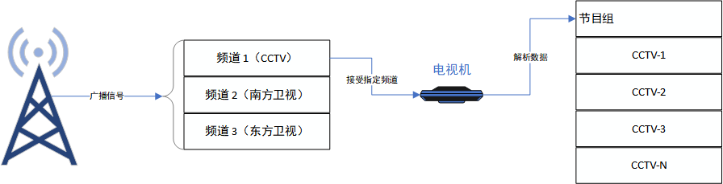

# MPEG-TS Container Format – Fundamentals of Audio and Video

Introduction and explanation of the MPEG-TS container format

## Introduction to MPEG

Let's break down what MPEG is and how it fits within the broader organizational structure. MPEG stands for Moving Picture Experts Group. It's essentially a specialized working group operating within the Joint Technical Committee (JTC1), jointly established by two major standardization bodies: the International Organization for Standardization (ISO) and the International Electrotechnical Commission (IEC).

JTC1 is tasked with setting standards for information technology. Within JTC1, there's a subgroup known as SG29, which focuses specifically on the "Coding of audio, picture, multimedia, and hypermedia information." This subgroup oversees various working groups, including well-known entities like JPEG (Joint Photographic Experts Group) and WG11, which concentrates on compression techniques for moving pictures.

In simpler terms, MPEG can be understood as a part of the larger ISO/IEC JTC1/SG29/WG11 structure. It was established in 1988 with the primary goal of developing standards for coding moving pictures.

Picture MPEG as an entity dedicated to the development of standards for audio and video compression and transmission. Currently, the MPEG organization has established five main standards: _MPEG-1_, _MPEG-2_, _MPEG-4_, _MPEG-7_, and _MPEG-21_. The **MPEG-TS** container format is defined within the **MPEG-2** standard.

## MPEG-2 Standard

Let's briefly introduce the _MPEG-2_ standard. It's widely used in internet transmission protocols, early cable and terrestrial digital television, satellite TV, DVB, DVD, and more.

The _MPEG-2_ standard is divided into **_10_** parts, collectively known as the _ISO/IEC 13818_ international standard, titled "GENERIC CODING OF MOVING PICTURES AND ASSOCIATED AUDIO."

| Part      | Title                                             | Description                                                                                        |
| --------- | ------------------------------------------------- | -------------------------------------------------------------------------------------------------- |
| 13818-1   | Systems                                           | Describes how multiple audio, video, and data elementary streams are                               |
|           |                                                   | combined into transport streams and program streams.                                               |
| --------- | ------------------------------------------------- | -------------------------------------------------------------------------------------------------- |
| 13818-2   | Video                                             | Describes video coding methods.                                                                    |
| 13818-3   | Audio                                             | Describes audio coding methods that are _backward compatible_ with the _MPEG-1 audio_ standard.    |
| 13818-4   | Compliance testing                                | Describes how to determine if a bitstream conforms to the _MPEG-2_ standard.                       |
| 13818-5   | Software implementation                           | Describes software implementation methods for parts 1, 2, and 3 of the _MPEG-2_ standard.          |
| 13818-6   | DSM-CC (Digital Storage Media Command & Control)  | Describes the session signaling set between servers and users in interactive multimedia networks.  |

The remaining **_4_** parts of the _MPEG-2_ standard are not listed here as they are not widely used. As you can see from the table above, the definition of the **_MPEG-TS_** container format is in **13818-1** (Systems). In 1990, the ATM Video Coding Experts Group collaborated with the MPEG organization to develop ITU-T Rec. _H.220_ (Systems) based on ISO/IEC 13818-1 and ITU-T Rec. _H.262_ (Video) based on 13818-2. Both _H.220_ and _H.262_ are part of the **ITU-T** standards.

Download link for the ISO/IEC 13818-1 and ITU-T Rec. _H.220_ standard document package: [Baidu Netdisk](https://pan.baidu.com/s/1LDGjSVdvZQ3t-ngFnQQsHQ), extraction code: f0cv

It's worth noting that different organizations often collaborate to extend, derive, or extract specific parts from existing standard documents.

## MPEG-TS Container Format

Now let's delve into the **_MPEG-TS_** container format. Files with the _`.ts`_ extension use this format, where _"ts"_ stands for Transport Stream.

There's another container format called **_MPEG-PS_**, where _"ps"_ stands for Program Stream. Note that "Program" here refers to a television program, not a computer program. The PS container format is primarily used in environments where errors are unlikely to occur, such as DVDs.

TS streams have a fixed packet structure of 188 bytes, while PS streams have variable-length packets. The fixed packet structure of TS streams provides better resilience against transmission errors.

What are **transmission errors**?

> Transmission errors occur when the signal's voltage is altered during transmission, causing the signal to be corrupted. Noise, electrical surges or lightning, equipment failures, and other factors can lead to transmission errors (e.g., a transmitted 1 is received as a 0, or vice versa). Due to various reasons, digital signals inevitably experience errors during transmission. - Baidu Encyclopedia

Transmission errors typically manifest at a lower level, where digital signals are represented as binary streams (e.g., 111000). An error arises when a '1' changes to a '0' during transmission. This is why protocols like TCP and UDP have a **checksum** field. In the event of an error, the lower layer discards the packet instead of forwarding it to the application layer.

In practice, both TS and PS container formats exhibit similar resilience to transmission errors when employed with UDP or TCP, as these protocols adeptly handle error scenarios. Nevertheless, it's important to note that TS and PS standards extend beyond UDP and TCP; devices within the digital video domain, such as video recorders and DVD players, frequently utilize both PS and TS formats.

## Digital Television and MPEG-TS

Both TS and PS were primarily used in the **digital television** domain. The digital television standard used in China is DVB, which stands for Digital Video Broadcasting.

Traditional television sets have multiple channels, and the receiving antenna can switch between them to receive different channels. Each channel contains multiple programs (remember the concept of "Program," which is frequently used in the MPEG-2 documentation).

For example, the CCTV channel may have programs CCTV1-CCTV14 running simultaneously, each with its own audio and video streams. The structure is as follows:

So, how are these channels, programs, and audio/video streams distinguished within a TS stream? This is where the complexity of the TS container format comes in. Early television sets (receiving devices) had limited capabilities and couldn't interact with the base station. They could only passively receive digital signals broadcasted by the base station.

Internet transmission using TCP/UDP involves **digital signals**, and digital television base stations also broadcast **digital signals** (e.g., 001001). However, TS container format used in internet streaming typically transmits only one video and one audio stream, **so many fields within the TS packet are not necessary in this context.** Internet-based TS encapsulation is a simpler use case. This type of single-program TS encapsulation is called _Single Program Transport Stream_ _(SPTS)_.

If you need to develop set-top boxes or similar devices and want a deeper understanding of digital television, you can refer to the book "Video Demystified: A Handbook for The Digital Engineer."

## Analyzing MPEG-TS with Tools

Now, let's move on to some practical analysis. As usual, we need a software that can parse the TS format. Here are some options:

1. **Elecard Stream Analyzer:** Supports TS, FLV, MP4, and many other formats. It offers a 30-day free trial. Download link: [Baidu Netdisk](https://pan.baidu.com/s/10zh7LCBmLdT1s_5yRj21ZQ), extraction code: sq5y
2. **MPEG-2 TS Packet Analyzer:** A tool with a clear and simple interface. Download link: [Baidu Netdisk](https://pan.baidu.com/s/1wFPLCBHtbXEF4p68j2Dn2w), extraction code: hmxj
3. **juren.ts:** The TS stream file used in this article. Download link: [Baidu Netdisk](https://pan.baidu.com/s/1AgzIe23W9uh-7klsGv8Jog), extraction code: igs5

**Note: Elecard Stream Analyzer is highly recommended. It's an excellent software, and all products from Elecard are worth trying out.**

---

Using Stream Analyzer, open the juren.ts file. The screenshot is as follows:

## Basic Data Types in MPEG-TS

Within a TS stream, there are 3 main types of data packets:

1. **ES (Elementary Stream):** You can think of an ES packet as a single **H.264 encoded** video frame or an audio frame, although ES is not limited to just audio/video frames.
2. **PES (Packetized Elementary Stream):** An ES packet with an additional layer of information, including PTS, DTS, and other data.
3. **TS (Transport Packet):** A fixed-length packet of 188 bytes. A large PES packet is divided into smaller chunks and encapsulated into TS packets for transmission.

## Analyzing TS Packet Structure

Let's start by analyzing the fields within a TS packet. See the image below:

###### Please note that Stream Analyzer does not parse the fields in byte order. The displayed fields are not in sequential order.

As shown in the image above, the "Transport Packet" is the TS packet. These packets always start with **_0x47_**, which facilitates synchronization in certain scenarios. The ISO/IEC 13818-1 standard document provides the syntax for parsing a TS packet:

In the image above, `sync_byte` is **_0x47_**, and `transport_packet()` is a function for parsing a TS packet. The **syntax** is as follows:

Note the term **syntax**. The MPEG documentation often provides syntax in a C-like language, making it easy to understand for those familiar with C. The syntax is essentially **pseudocode**.

From the syntax, we can see that the TS packet header contains the following main fields:

1. **sync_byte:** Synchronization byte, always **_0x47_**. Located at bits **_0-7_**. If there is identical content of 0x47 but not a sync byte, it might require escape processing (further investigation needed).

   **Additional notes:** It seems escaping 0x47 might not be necessary as **_the TS packet length is fixed at 188 bytes_**. This needs to be confirmed by examining the actual parsing code.

2. **transport_error_indicator:** Indicates transmission errors. In TCP/UDP scenarios, this field should always be 0.
3. **payload_unit_start_indicator:** Indicates the start of the payload. Since a PES packet is divided into multiple TS packets, a start marker is needed.
4. **transport_priority:** Transmission priority. This field is not commonly used in internet applications and can be ignored for now.
5. **PID (Packet Identifier):** This is not an abbreviation for "Program." The PID helps identify the type of data within the payload. The standard document provides the following information:

   

6. **transport_scrambling_control:** This is a restriction field, often used for pay-per-view programs. In the past, satellite TV required a card and payment to access certain channels. This field is rarely used in internet scenarios.
7. **adaptation_field_control:** Variable field flag with four possible values. 10 and 11 indicate that there are additional fields to be parsed, while 01 and 11 indicate that the TS packet has a payload.

   

8. **continuity_counter:** If the TS packet contains a payload, this field increments. It seems to be rarely used in internet applications (further investigation needed).
9. **data_byte:** This marks the start of the payload data. The syntax in the documentation involves a loop that processes the data N times, where N is calculated as 184 minus the size of the adaptation field. You can think of N as the payload size. However, actual code implementations may not use a loop with N iterations.

---

## Manual Parsing of TS Packet Header

Let's use Notepad++ to manually parse the first few fields of a TS packet. Refer to the image below:

The first byte of a TS file is always 0x47. In internet streaming scenarios, the `sync_byte` is somewhat redundant and exists for compatibility reasons. If designing a container format specifically for TCP/UDP, this 0x47 byte would not be necessary. TCP transmission of m3u8 TS live streams likely doesn't include this 0x47 byte (further confirmation needed through packet capture analysis).

> In the ATSC standard, the 0x47 sync byte is never encoded or transmitted. Instead, a specific 2-level sync pulse is used for transmission, and the receiver inserts the 0x47 sync byte at this position.

Next, the 1st and 2nd bytes are 0x40 and 0x11. These two bytes are composed of the `transport_error_indicator`, `payload_unit_start_indicator`, `transport_priority`, and `PID` fields.

Convert 0x40 0x11 to binary: 0100 0000 0001 0001. Reading from left to right (note that there is no 0th bit, we start from the 1st bit), the first bit is 0, indicating that `transport_error_indicator` is 0 (no transmission error). The second bit is 1, which is the `payload_unit_start_indicator`, signifying that this is the start of the payload. The third bit is 0, representing a `transport_priority` of 0.

The remaining 13 bits represent the PID value: 0 0000 0001 0001, which is 17 in decimal.

Moving on to the 3rd byte, the value is 0x10, which is 0001 0000 in binary. The 3rd byte is composed of `transport_scrambling_control`, `adaptation_field_control`, and `continuity_counter`, as shown below:

Finally, the 4th byte is the `data_byte`, with a value of 00. This completes the analysis of the 8 fields in the TS packet header.

Table 2-3 in the documentation mentions "bslbf" and "uimsbf." These stand for "Bit string, left bit first" and "Unsigned integer, most significant bit first," respectively. You can find these definitions in the standard document.

---

## Analyzing Payload and PSI

Let's examine the subsequent bytes in the TS packet:

The "ff" bytes in the image above are padding bytes used to fill the packet to its 188-byte size. This is somewhat wasteful for internet traffic, as the TS format was not originally designed for internet usage.

How do we know that these bytes represent the "Service Description Table"? It's based on the PID value of 0x11 in the header. The parsing syntax for the Service Description Table is as follows:

The first TS packet in the juren.ts file is actually a custom element. From the PID of 0x11 and the `table_id` of 0x42, we can tell that it's "User private." I'll just mention that I spent some time trying to understand the purpose of this initial TS packet but couldn't figure it out. It would be helpful to analyze these syntax documents alongside the TS parsing code (e.g., the TS-related code in FFmpeg) to fully grasp the details.

---

Now let's look at the second TS packet:

As shown in the image, both the PID and `table_id` are 0, indicating that the content of this TS packet is the PAT (Program Association Table). Recall that we mentioned earlier that TS packets encapsulate PES packets, but not exclusively. TS can also encapsulate PSI (Program Specific Information) data. PSI is not a single table but rather a collective term for tables like PAT, PMT, CAT, and NIT, as shown below:

---

We've briefly touched upon the concept of PSI, but the TS container format is quite complex with numerous tables. Readers are encouraged to delve deeper into understanding TS by examining the relevant code.

## Tracking a Video Frame

Let's try to locate all the TS packets that make up the first video frame. This will help us further understand the TS encapsulation process. Using Qt Creator, we can examine the contents of an AVPacket:

In FFmpeg's AVPacket structure, the `data` pointer points to the actual H.264 encoded data, while the `pos` field points to the starting position of the TS packet. We can observe TS markers like 0x47 and 0x41.

The first video frame has a size of 3768 bytes, starting with 00 00 01 09 f0 00 00 00 00 06 00 07 and ending with ab 28 fd 45 f9 30 42 22 70 34 00 00 03 00 00 03 00 02 1e 00.

Due to its size, this frame must be distributed across multiple TS packets. Let's identify all the relevant TS packets:

There are a few things to note in the image above:

1. There are approximately 20 TS packets that form the first video frame.
2. Only the first TS packet has a `payload_unit_start_indicator` of 1; the rest are 0.
3. The `continuity_counter` field increments continuously.

---

## Conclusion

This concludes our analysis of the MPEG-TS container format. We've covered some basic concepts, and readers are encouraged to further explore the ISO/IEC 13818-1 standard document and the TS-related code in FFmpeg for a deeper understanding.

Here are some additional points:

- Both MPEG-PS and MPEG-TS are based on PES encapsulation, so they can be converted to each other.

---

## References

1. [MPEG-PS Container Format](https://www.cnblogs.com/CoderTian/p/7701597.html)
2. [TS Container Format Introduction and Analysis](https://blog.csdn.net/guoyunfei123/article/details/106319893)
3. [MPEG-2](https://blog.csdn.net/houxiaoni01/article/details/99831303)
4. [MPEG2 Series Protocol Introduction](https://blog.csdn.net/aflyeaglenku/article/details/53302172)
5. "MPEG Fundamentals and Protocol Analysis Guide" - Tektronix

---

## Further Reading

1. Video Demystified: A Handbook for The Digital Engineer.
2. ISO/IEC 13818-1 Standard
